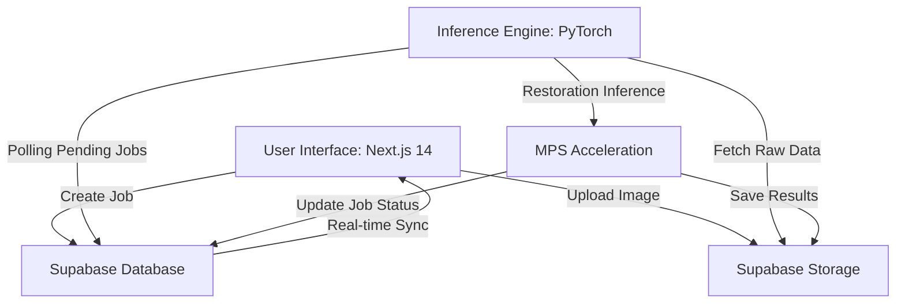

# Research Report: AI 기반 광학 수차 보정 및 초해상도(Super-resolution) 영상 복원 시스템

## 1. Research Background: Optical Degradation Physics
광학계에서 획득되는 모든 영상은 물리적 한계로 인해 원본 정보의 감쇠(Degradation)를 수반한다. 본 연구는 광학적 열화 과정을 수학적으로 모델링하고 이를 역산하여 복원하는 시스템을 구축하는 데 목적이 있다.

### 1.1. 영상 저하의 수학적 모델링
일반적인 광학 시스템에서의 영상 획득 과정은 다음과 같은 컨볼루션(Convolution) 모델로 정의된다:
$$y = x * h + n$$
여기서 $y$는 관측된 저화질 영상, $x$는 복원하고자 하는 이상적인 원본 영상, $h$는 점 확산 함수(PSF, Point Spread Function), $n$은 가산성 노이즈(Additive Noise)를 의미한다. 광학계의 불완전성은 $h$의 확산을 야기하며, 이는 결과적으로 영상의 고주파 성분 손실을 초래한다.

### 1.2. 주요 광학적 수차 및 회절 한계
*   **구면 수차(Spherical Aberration):** 렌즈의 기하학적 형상으로 인해 광선이 한 점에 모이지 않고 초점 거리에 따라 분산되는 현상으로, 전체적인 선예도 저하를 유발한다.
*   **색수차(Chromatic Aberration):** 빛의 파장에 따른 굴절률 차이로 인해 경계면에서 색 번짐이 발생하는 현상을 규명한다.
*   **회절 한계(Diffraction Limit):** 광학계의 구경(Aperture) 크기에 따른 물리적 한계로, Airy disk 패턴에 의해 인접한 두 점을 구분할 수 없게 되는 근본적인 해상도 제약을 의미한다.

---

## 2. AI-Driven Restoration Methodology
본 시스템은 전통적인 필터링 기법의 한계를 극복하기 위해 최신 딥러닝 아키텍처를 활용하여 비선형적인 광학 복원을 수행한다.

### 2.1. 복원 아키텍처 (Restoration Architecture)
*   **Blind Deconvolution:** PSF($h$)가 미지인 상태에서 영상 $x$를 추정하기 위해, 심층 신경망을 통한 커널 추정과 특징량 추출을 병렬로 수행한다.
*   **SwinIR & Vision Transformer:** 윈도우 기반의 셀프 어텐션(Self-Attention) 메커니즘을 적용하여 영상의 국부적(Local) 특징과 전역적(Global) 문맥을 동시에 학습함으로써, 격자 무늬 없는 고해상도 복원을 달성한다.
*   **Generative Adversarial Networks (SRGAN):** 적대적 학습을 통해 미세한 질감(Texture)을 재구성하여 시각적 인지 품질을 극대화한다.

### 2.2. 다중 목표 손실 함수 (Loss Function)
물리적 일관성과 시각적 유사성을 동시에 확보하기 위해 다음과 같은 손실 함수를 구성한다:
1.  **Perceptual Loss:** VGG 네트워크의 특징 맵 거리를 최소화하여 고차원 정보를 보존한다.
2.  **SSIM Loss (Structural Similarity Index):** 인간의 시각 구조에 기반한 휘도, 대비, 구조적 유사도를 최적화한다.
3.  **Frequency Domain Loss:** FFT(Fast Fourier Transform)를 통해 주파수 영역에서의 오차를 최소화함으로써 고주파 디테일의 복원 정확도를 높인다.

---

## 3. System Architecture & Real-time Processing
고용량 광학 데이터의 효율적인 처리와 실시간 모니터링을 위해 현대적인 클라우드 네이티브 아키텍처를 채택한다.

### 3.1. 엔드투엔드 파이프라인
사용자가 영상을 업로드하면 Next.js 프론트엔드에서 Supabase로 데이터를 전송하며, 백엔드 PyTorch 엔진이 이를 감지하여 비동기적으로 복원을 수행한다.

---

## 4. Practical Research Use-cases
본 연구 결과는 다양한 정밀 광학 분야에서 활용 가능성을 제시한다.

*   **저가형 광학계 성능 고도화:** 스마트폰 카메라나 저가형 렌즈에서 발생한 수차를 소프트웨어적으로 보정하여 고성능 렌즈 수준의 결과물을 도출한다.
*   **바이오/천문 데이터 정밀화:** 광학 현미경의 회절 한계를 초과하는 초해상도(Super-resolution) 복원을 통해 미세 구조 식별 능력을 강화하거나, 망원경 영상의 대기 산란 및 렌즈 블러를 제거한다.
*   **정량적 평가 지표 (MTF Metrics):** 복원 전후의 변조 전달 함수(Modulation Transfer Function) 변화를 분석하여 광학 시스템의 해상력 개선 수치를 수치적으로 증명한다.

---

## 5. Implementation & Optimization

### 5.1. 환경 구성 (Development Environment)
*   **Runtime:** Node.js 18+, Python 3.10+
*   **Core Libraries:** 
    *   `PyTorch`: AI 모델 학습 및 추론
    *   `OpenCV` & `SciPy`: 광학 필터링 및 전처리
    *   `Next.js 14`: 반응형 연구 대시보드 인터페이스

### 5.2. 하드웨어 가속 최적화
Apple Silicon 환경에서의 효율적인 추론을 위해 **MPS(Metal Performance Shaders)** 백엔드를 활성화한다. 이를 통해 대용량 타일링(Tiling) 처리 시 CPU 대비 최대 10배 이상의 연산 속도 향상을 구현하며, 메모리 관리를 최적화하여 고해상도 이미지 처리 중 발생하는 OOM(Out of Memory) 문제를 방지한다.

---

### [Author & Contact]
**Author:** 권해성 (Hanyang University, Computer Science)  
**Research Interest:** Computational Photography, Image Restoration, Optical System Optimization  
**Affiliation:** Hanyang University Wave-AI Lab Application Portfolio
